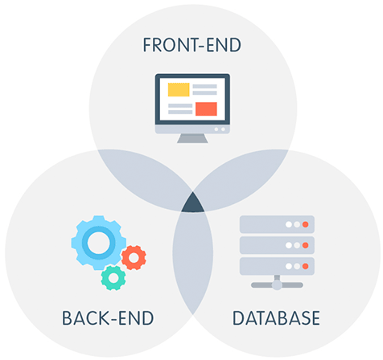
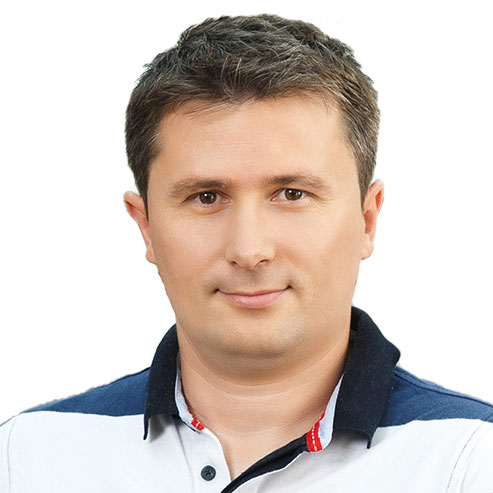

# UTOPIAE » GVW II » Full-Stack Web Development

## Title

**Full-Stack Web Development** presentation given on 19th November 2019 at [Institut "Jožef Stefan"](https://ijs.si/ijsw/V001/JSI) in [Ljubljana, Slovenia](https://goo.gl/maps/dhN379tuSTu1vd948).

## Description

The aim of the tutorial is to introduce participants to a **Full-Stack Web Development**, where a wide range of technologies and knowledge is required. An **overview of technologies** supporting WWW and web applications will be given. Participants will be introduced to **designing static web pages** and to the process of continuous improvement by employing **dynamics on the client** and **the server side**. To support advanced web application development, **REST API** layer will be proposed to enable database access. The benefits of **Single Page Applications (SPA)** will be discussed and the need for **user authentication** with **security** aspects at all levels of developed application will be emphasized.

## Presenter

[**Dejan Lavbič**](https://www.lavbic.net/en/), PhD, Assistant Professor 
[University of Ljubljana](https://www.uni-lj.si/eng/), [Faculty of Computer and Information Science](https://www.fri.uni-lj.si/en), [Laboratory for Data Technologies](http://lpt.fri.uni-lj.si/)

## Materials

* [presentation slides](/docs/slides.pdf),
* [additional material](/docs/).
